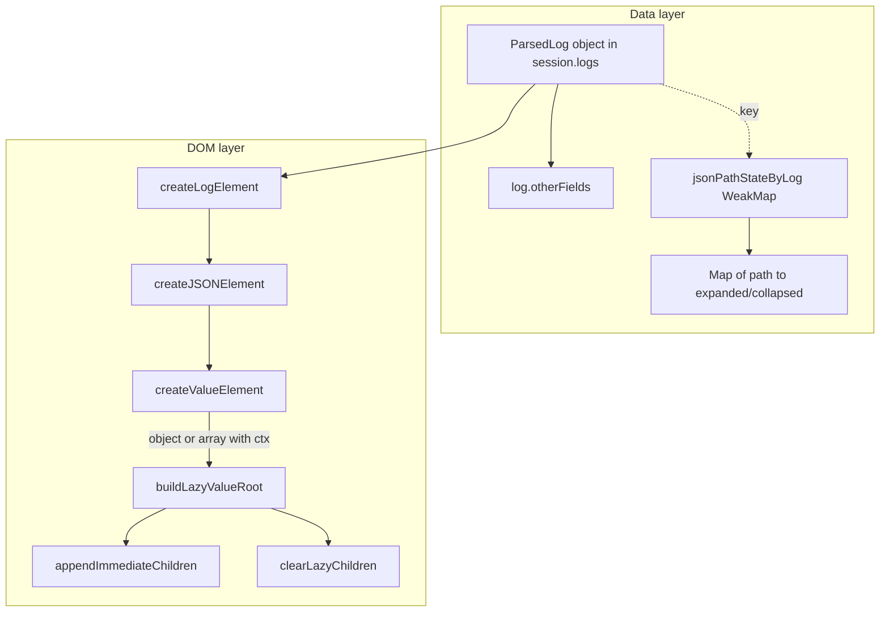
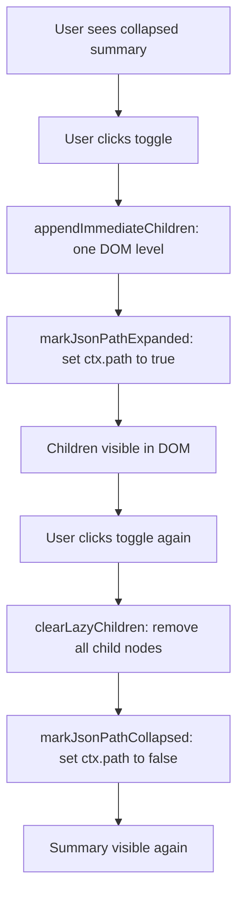
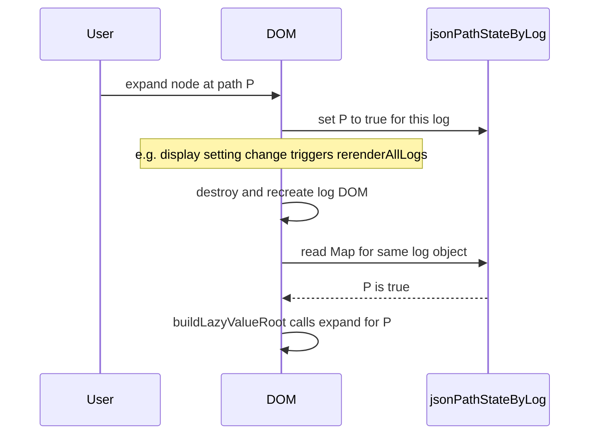
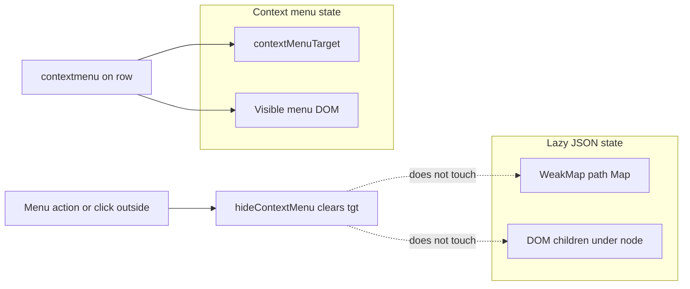

## Lazy collapsible JSON (objects / arrays)

### Purpose

Structured log fields (`log.otherFields`) can be large nested objects or arrays. The viewer renders **only one level at a time**: collapsed nodes show a short summary (`{ … }` / `[ … ]` plus counts). **Expanding** builds the immediate children in the DOM; **collapsing** removes those nodes again. That keeps work and DOM size proportional to what the user has opened, not to the full tree depth.

The **default** state of a node the user has not toggled follows the `slogViewer.collapseJSON` setting: collapsed when `true`, expanded when `false` (so with `false` the whole tree is built up front).

When `slogViewer.expandNestedJSONOnOpen` is `true`, opening a log entry (clicking its header) adds that `ParsedLog` to `deepExpandedLogs` (a **`WeakSet`**) and rebuilds its body; untoggled paths of logs in that set default to **expanded**, so the whole tree opens on click. Other logs keep the `collapseJSON` default. Resolution order in `isJsonPathExpanded`: user toggle entry → `deepExpandedLogs` membership (when the setting is on) → `!collapseJSON`.

### Where state lives

| State                      | Location                                                                                                   | Role                                                                                                         |
| -------------------------- | ---------------------------------------------------------------------------------------------------------- | ------------------------------------------------------------------------------------------------------------ |
| **Toggled paths per log**  | `jsonPathStateByLog` — a **`WeakMap`** keyed by the **same `ParsedLog` object** used in `session.logs`     | Value: `Map<string, boolean>` of JSON paths (e.g. `user`, `user.address`, `items[0]`) the user explicitly **expanded** (`true`) or **collapsed** (`false`). Paths without an entry use the `collapseJSON` default |
| **Transient UI**           | DOM under each `.json-lazy-children` container                                                             | Only exists while the node is expanded; removed on collapse                                                  |
| **Context menu**           | `contextMenuTarget` (separate variable)                                                                    | Holds `{ field, value, fileInfo }` for the **last right‑click**; not tied to lazy expansion                  |

The **WeakMap** is intentional: when a log row is dropped from memory (clear session, eviction, GC), expansion bookkeeping can disappear with it—no leak of per-log state.

### Path strings

Paths identify a value **from the root of `otherFields`**. Segments use `.` for safe identifiers and `[index]` / `["quoted key"]` when needed (`appendJsonPath`, `parsePathSegments`, `getValueAtOtherFieldsPath`).

### High-level architecture

### Expand / collapse flow (lazy node)

- **Expand**: fills the children container once for that level, sets `aria-expanded`, shows the block. On a user click, **`Map.set(path, true)`**.
- **Collapse**: empties the children container (next expand rebuilds that level), hides the block. On a user click, **`Map.set(path, false)`** for **that node only**. Deeper paths keep their entries; when the parent is expanded again, nested nodes restore their toggled state (or fall back to the `collapseJSON` default).
- Only **user clicks** write to the `Map`. Automatic expansion during render (from the default or a remembered entry) does not, so untouched paths keep following `collapseJSON` when the setting changes.

### After a full DOM rebuild (same log object)

`renderCurrentSessionLogs` / `rerenderAllLogs` replace the log list DOM but keep **`session.logs` references**. On `buildLazyValueRoot`, if `isJsonPathExpanded(logRef, path)` is true (remembered entry, else `!config.collapseJSON`), **`expand()`** runs immediately so the tree matches the **WeakMap** again.

This applies only to rebuilds that keep the same `ParsedLog` objects. Field-alias setting changes use `replaceSessionLogs`, which re-parses each raw line and replaces `session.logs` with new `ParsedLog` objects, so the WeakMap keys no longer match and expansion state is reset.

### Context menu vs lazy expansion

These are **orthogonal**:

1. **`attachContextMenuHandler(element, field, value, fileInfo)`** registers `contextmenu` → `showContextMenu`, which sets **`contextMenuTarget`** and positions the menu. It does **not** read or write `jsonPathStateByLog`.

2. **Choosing Include/Exclude/Copy** in the menu uses `contextMenuTarget` and then **`hideContextMenu`**`. That only clears the menu target; it does **not** collapse lazy JSON nodes.

**Nested lazy rows** use `attachContextMenuHandler(row, childPath, displayValue, fileInfo)` so filters can use **dotted/bracket paths** under `otherFields` (`matchFilter` / `getFieldValue` resolve via `getValueAtOtherFieldsPath`).

### When expansion state is lost

- **Different log object** (new parse, new array slot in `session.logs`): new WeakMap entry—no remembered paths, so every node uses the `collapseJSON` default.
- **Field-alias settings changed**: `replaceSessionLogs` re-parses logs into new `ParsedLog` objects, so previous WeakMap entries do not apply.
- **Log removed from session / cleared**: reference gone; WeakMap entry is eligible for GC.
- **Collapse**: only that path is set to `false`; children disappear from DOM; **nested paths keep their entries** until toggled again or the log is GC’d.
